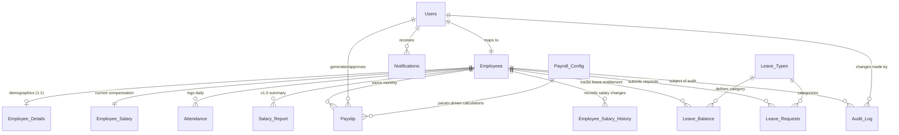

# Enterprise Payroll Management System (v2.0)

An enterprise-grade, high-performance MySQL-based Payroll Management System designed to support organizations with large employee counts, multi-tiered access control, automated payroll computation, full auditability, and leave tracking.

This repository contains the complete database engineering implementation for a payroll system, built and normalized to 3NF.

---

## Table of Contents
1. [System Architecture & ER Diagram](#1-system-architecture--er-diagram)
2. [Role-Based Access Control (RBAC) Matrix](#2-role-based-access-control-rbac-matrix)
3. [Stored Procedure & Helper Function API](#3-stored-procedure--helper-function-api)
4. [Trigger & Event Lifecycle Flows](#4-trigger--event-lifecycle-flows)
5. [Payroll Calculation Logic & Configuration](#5-payroll-calculation-logic--configuration)
6. [Performance Optimization & Indexing Strategy](#6-performance-optimization--indexing-strategy)
7. [Installation & Execution Guide](#7-installation--execution-guide)
8. [Production Verification & Example SQL Commands](#8-production-verification--example-sql-commands)

---

## 1. System Architecture & ER Diagram

The database structure preserves the original schema while extending it with 7 additional enterprise tables to support authentication, audit logs, leave tracking, configuration, and payslips.

### Entity Relationship (ER) Diagram



### Database Schema Specification

*   **`Users`**: Holds login credentials (password hashes generated via SHA-256), account status, and roles (`Admin`, `HR`, `Manager`, `Employee`).
*   **`Employees`**: The slim base employee record, containing department and designation, and self-referencing `manager_id` for management hierarchies.
*   **`Employee_Details`**: 1:1 table containing personal identification information, contact details, and dates of hire.
*   **`Employee_Salary`**: Contains current basic pay, HRA, DA, medical allowance, and special allowance.
*   **`Employee_Salary_History`**: Immutable archive storing historical salary structures, effective dates, actors, and reasons for changes.
*   **`Attendance`**: Time-tracking and check-in/out records. Automatically calculates actual hours and overtime hours.
*   **`Leave_Types`**: Master table for leave definitions (Casual, Sick, Earned, Maternity, Paternity, Comp-off, LOP).
*   **`Leave_Balance`**: Employee leave quotas (allocated, used, remaining) tracked per calendar year.
*   **`Leave_Requests`**: Lifecycle registry for employee leave requests (Pending, Approved, Rejected, Cancelled).
*   **`Payslip`**: Monthly ledger detailing the breakdown of gross pay, deductions (PF, Professional Tax, TDS, Loss of Pay), and net pay.
*   **`Audit_Log`**: Centralized, append-only security log auditing DML operations with JSON payloads capturing old and new values.
*   **`Payroll_Config`**: Global key-value registry dynamically driving financial formulas (PF percentages, tax slabs, threshold times).
*   **`Notifications`**: Internal communication channel used to simulate system emails and approval reminders.

---

## 2. Role-Based Access Control (RBAC) Matrix

Security is enforced directly at the database layer. Privileged stored procedures validate the caller's role by joining the calling `user_id` against the `Users` table and invoking `SIGNAL SQLSTATE '45000'` for unauthorized operations.

| Stored Procedure / Action | Admin | HR | Manager | Employee | Enforcement Mechanism |
| :--- | :---: | :---: | :---: | :---: | :--- |
| `sp_register_user` (privileged roles) | ✅ | ❌ | ❌ | ❌ | Caller role must be `Admin` |
| `sp_add_employee` | ✅ | ✅ | ❌ | ❌ | Caller role must be `Admin` or `HR` |
| `sp_update_salary` | ✅ | ✅ | ❌ | ❌ | Caller role must be `Admin` or `HR` |
| `sp_increment_salary` | ✅ | ✅ | ❌ | ❌ | Caller role must be `Admin` or `HR` |
| `sp_generate_payslip` | ✅ | ✅ | ❌ | ❌ | Caller role must be `Admin` or `HR` |
| `sp_approve_payroll` | ✅ | ✅ | ❌ | ❌ | Caller role must be `Admin` or `HR` |
| `sp_generate_monthly_payroll` | ✅ | ✅ | ❌ | ❌ | Caller role must be `Admin` or `HR` |
| `sp_approve_reject_leave` | ✅ | ✅ | ✅ | ❌ | Caller role must be `>= Manager` |
| `sp_add_attendance` (for others) | ✅ | ✅ | ❌ | ❌ | Caller must be `>= HR` or self |
| `sp_apply_for_leave` (for others) | ✅ | ✅ | ❌ | ❌ | Caller must be `>= HR` or self |
| `sp_check_in` / `sp_check_out` | ✅ | ✅ | ✅ | ✅ | Verified against current employee context |
| View own profile / payslips | ✅ | ✅ | ✅ | ✅ | Filtered dynamically by calling `user_id` |

---

## 3. Stored Procedure & Helper Function API

### Stored Procedures

1.  **`sp_authenticate_user(username, password, OUT user_id, OUT role, OUT message)`**
    *   Verifies username and password using SHA-256 hashing.
    *   Validates whether the user's account is active (`is_active = 1`).
    *   Updates the `last_login` timestamp and sets the session-level `@current_user_id`.
2.  **`sp_add_employee(calling_user_id, username, password, name, department, designation, emp_type, fname, lname, gender, dob, hire_date, email, phone, basic_pay, hra, da, medical, special, manager_id, OUT new_emp_id, OUT message)`**
    *   *Transaction-Safe*: Performs atomic insertion across `Users`, `Employees`, `Employee_Details`, `Employee_Salary`, and initial `Leave_Balance` structures.
    *   Rolls back the entire transaction if any single insert fails (e.g. duplicate username, validation failure).
3.  **`sp_update_salary(calling_user_id, emp_id, basic_pay, hra, da, medical, special, reason, OUT message)`**
    *   Updates the compensation profile of an employee.
    *   Sets `@salary_change_reason` and `@current_user_id` session variables to trigger automatic salary history logging.
4.  **`sp_increment_salary(calling_user_id, emp_id, percent, reason, OUT message)`**
    *   Applies a percentage-based basic salary increase. Automatically recalculates components and logs historical shifts.
5.  **`sp_add_attendance(calling_user_id, emp_id, date, status, check_in, check_out, remarks, OUT message)`**
    *   Manually inserts daily attendance. Triggers auto-determine if the entry is "Late" and calculates working hours.
6.  **`sp_check_in(emp_id, remarks, OUT message)`**
    *   Records daily check-in. Marks status as `Late` if check-in time exceeds the configured threshold.
7.  **`sp_check_out(emp_id, OUT message)`**
    *   Records daily check-out. Recalculates total working hours and overtime hours.
8.  **`sp_apply_for_leave(calling_user_id, emp_id, leave_type_id, from_date, to_date, reason, OUT request_id, OUT message)`**
    *   Submits a leave request. Checks remaining balances before allowing creation.
9.  **`sp_approve_reject_leave(calling_user_id, request_id, action, review_note, OUT message)`**
    *   *Transaction-Safe*: Promotes leave state. On approval, deducts requested days from `Leave_Balance`.
10. **`sp_generate_payslip(calling_user_id, emp_id, month, year, OUT payslip_id, OUT message)`**
    *   *Payroll Calculation Engine*: Computes the full monthly salary breakdown, reads from `Payroll_Config`, aggregates attendance, calculates LOP, and creates the `Payslip` record.
11. **`sp_approve_payroll(calling_user_id, payslip_id, OUT message)`**
    *   Approves a processed payslip and flags it for payout.
12. **`sp_generate_monthly_payroll(calling_user_id, month, year, OUT generated, OUT message)`**
    *   Cursor-driven batch engine processing monthly payroll for all active employees lacking a payslip for the given period.

### Helper Functions

*   **`fn_get_config(key)`**: Returns the configuration value cast to `DECIMAL(12,4)` for direct math use.
*   **`fn_calc_professional_tax(gross)`**: Applies slab-based tax structures based on the calculated gross pay.
*   **`fn_has_permission(user_id, min_role)`**: Evaluates user role hierarchy during RBAC checking.

---

## 4. Trigger & Event Lifecycle Flows

### Trigger Execution Flow

```
                      +-----------------------------+
                      |    DML Operation Trigger    |
                      +--------------+--------------+
                                     |
             +-----------------------+-----------------------+
             |                                               |
             v                                               v
     [ BEFORE triggers ]                             [ AFTER triggers ]
 - Validate salary > 0                          - Log changes to Audit_Log
 - Block negative allowances                     (as JSON old vs new diff)
 - Auto-detect Late arrivals                    - Auto-insert Salary History
 - Recalculate working hours                    - Deduct leave balances
 - Prevent duplicate attendance                 - Update Payslip audit trail
```

*   **`trg_before_salary_insert` / `trg_before_salary_update`**: Guards database integrity by ensuring basic salary > 0 and preventing negative values for allowances.
*   **`trg_after_salary_update`**: Automatically populates the historical audit ledger (`Employee_Salary_History`) on changes.
*   **`trg_before_attendance_insert` / `trg_before_attendance_update`**: Automatically computes `working_hours` and `overtime_hours`, and determines `Late` status by analyzing check-in timings.
*   **`trg_before_employee_delete`**: Protects historical payroll records by blocking hard deletes for employees with active transactions.
*   **`trg_before_leave_update` / `trg_after_leave_update`**: Enforces leave balances before approval, updates `Leave_Balance` metrics on state changes, and audits transitions.

### Automated Events (MySQL Event Scheduler)

1.  **`evt_monthly_payroll`**: Runs on the 1st of every month at 00:30. Auto-triggers batch payroll generation for the previous month.
2.  **`evt_payroll_reminders`**: Runs weekly. Dispatches internal reminder notices if payroll items remain in a "Processed" state without approval.
3.  **`evt_leave_balance_reset`**: Runs annually on Jan 1st. Resets balances and carries forward unused Earned Leaves.
4.  **`evt_archive_old_reports`**: Runs quarterly. Signals warning flags to clean/archive historical summary tables older than 2 years.

---

## 5. Payroll Calculation Logic & Configuration

The payroll engine calculates salaries dynamically on a monthly basis. All inputs are configurable in `Payroll_Config`.

### Dynamic Financial Formulas

$$\text{Gross Salary} = \text{Basic Pay} + \text{HRA} + \text{DA} + \text{Medical Allowance} + \text{Special Allowance} + \text{Bonus} + \text{Overtime Pay}$$

*   **$\text{Bonus}$**: Configured as $8.33\%$ (statutory minimum) of the basic salary.
*   **$\text{Overtime Pay}$**: Calculated as $\text{OT Hours} \times \text{Overtime Rate Per Hour}$ (configured at 150.00 INR/hr).

$$\text{Total Deductions} = \text{PF Deduction} + \text{Professional Tax} + \text{Income Tax (TDS)} + \text{Loss of Pay (LOP)}$$

*   **$\text{PF Deduction}$**: Configured as $12\%$ of the basic salary.
*   **$\text{Income Tax (TDS)}$**: Configured as a simplified flat $10\%$ of the Gross Salary.
*   **$\text{Loss of Pay (LOP)}$**: Calculated dynamically:
    $$\text{LOP} = \text{Days Absent} \times \left( \frac{\text{Basic Pay}}{\text{Standard Monthly Working Days (26)}} \right)$$
*   **$\text{Professional Tax (PT)}$**: Computed dynamically using dynamic slab thresholds:
    *   $\text{Gross Salary} \le 10,000$: $0$ INR
    *   $\text{Gross Salary} \le 15,000$: $150$ INR
    *   $\text{Gross Salary} > 15,000$: $200$ INR

$$\text{Net Salary} = \max(0, \text{Gross Salary} - \text{Total Deductions})$$

---

## 6. Performance Optimization & Indexing Strategy

To support enterprise workloads, columns frequently used in queries and joins are explicitly indexed.

### Configured Indexes

1.  **Composite Indexes**:
    *   `Employees(department, status)`: Accelerates batch payroll filters scanning active members in specific cost centers.
    *   `Attendance(emp_id, date)`: Speeds up date-range lookups during monthly aggregations.
    *   `Leave_Balance(emp_id, leave_type_id, year)`: Facilitates balance validation.
    *   `Users(role, is_active)`: Optimizes system user permission verification.
2.  **Covering Indexes**:
    *   `Attendance(emp_id, status)`: Speeds up LOP calculation queries that count absences.
    *   `Payslip(emp_id, year)`: Accelerates employee self-service historical payslip queries.
3.  **Unique Constraints**:
    *   `Attendance(emp_id, date)`: Enforces data integrity at the storage engine level, preventing duplicate check-ins.
    *   `Payslip(emp_id, month, year)`: Prevents running duplicate payroll computations for the same billing cycle.

### EXPLAIN Query Verification

Executing a typical monthly attendance scan:
```sql
EXPLAIN SELECT * FROM Attendance 
WHERE emp_id = 50 AND date BETWEEN '2025-01-01' AND '2025-06-30';
```
The query execution plan shows a `range` scan using `uq_att_emp_date` or `idx_att_emp_date` as the index key, filtering ~130 records in milliseconds rather than performing a full table scan.

---

## 7. Installation & Execution Guide

### Prerequisites

*   MySQL 8.0 or higher.
*   Global privilege permissions (to enable the MySQL Event Scheduler).

### Step-by-Step Installation

1.  Clone the repository or download the script files.
2.  Open your terminal and execute the script against your database instance:
    ```bash
    mysql -u root -p < "payroll_enterprise.sql"
    ```
    Alternatively, inside your MySQL client:
    ```sql
    mysql> source /Users/apple/Desktop/Employee Payroll System/payroll_enterprise.sql;
    ```
3.  Confirm database creation and deployment:
    ```sql
    SHOW TABLES;
    SHOW EVENTS;
    ```

*Note: The script automatically seeds standard configurations, leave types, 500 active employee records, 20 managers, 65,000+ attendance records, and 4 months of historical payslip data.*

---

## 8. Production Verification & Example SQL Commands

Verify the database engine's features by executing these standard administration commands:

### Testing User Authentication
Verify that credentials are validated using SHA-256:
```sql
-- Valid Credentials (Returns Admin ID and role)
CALL sp_authenticate_user('admin', 'Admin@123', @uid, @role, @msg);
SELECT @uid AS user_id, @role AS user_role, @msg AS status_msg;

-- Invalid Credentials (Returns NULL values and failure notice)
CALL sp_authenticate_user('admin', 'wrong_pass', @uid, @role, @msg);
SELECT @uid AS user_id, @role AS user_role, @msg AS status_msg;
```

### Testing RBAC Security Enforcement
Attempt to update a salary structure using an Employee user ID (e.g. `emp_id = 500`) to verify that the query is rejected:
```sql
-- Should trigger SQLSTATE 45000: Access Denied
CALL sp_update_salary(500, 50, 65000.00, 26000.00, 6500.00, 1250.00, 3000.00, 'Malicious Attempt', @msg);
```

### Generating & Approving Monthly Payslips
Run payroll for a specific employee and approve it:
```sql
-- Generate Payslip for May 2025 (emp_id = 50) using Admin credentials (user_id = 1)
CALL sp_generate_payslip(1, 50, 5, 2025, @psid, @msg);
SELECT @psid AS generated_payslip_id, @msg AS status_msg;

-- Approve the generated payslip
CALL sp_approve_payroll(1, @psid, @msg);
SELECT @msg AS approval_status_msg;

-- Query the Monthly_Payroll_View for details
SELECT employee_name, department, gross_salary, pf_deduction, loss_of_pay, net_salary, payroll_status 
FROM Monthly_Payroll_View 
WHERE payslip_id = @psid;
```

### Running Dashboard Analytics
Explore the seeded dataset using the analytical views:
```sql
-- View top 5 highest paid employees
SELECT employee_name, department, designation, net_salary, overall_rank 
FROM Top_Earners_View 
LIMIT 5;

-- View department payroll expenses
SELECT department, headcount, total_gross, total_net_salary, avg_net_salary 
FROM Department_Expense_View 
ORDER BY total_net_salary DESC;
```
